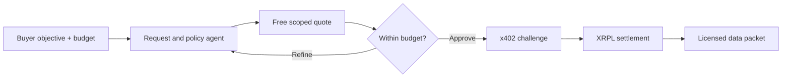

# SignalSlice

**Decision-ready market intelligence, purchased by AI agents one query at a time.**

SignalSlice is a pitch-ready prototype for Vida Loca. A buyer describes a business objective and spending limit; the agent clarifies missing scope, ranks matching intelligence, selects the richest affordable packet, completes an x402 payment on the XRP Ledger, and unlocks the licensed data.

The data is the product. x402 removes checkout and account friction; XRPL provides low-cost machine settlement and a verifiable receipt.

## Commercial loop

1. A company submits an objective and an autonomous spending limit.
2. The agent extracts sector and region or asks for clarification instead of guessing.
3. SignalSlice previews coverage, freshness, fields, and a redacted sample for free.
4. The agent chooses among 1,000-, 2,500-, and 5,000-drop packets without exceeding its mandate.
5. The protected endpoint returns an x402 `402 Payment Required` challenge.
6. The buyer agent signs an exact XRPL payment; the facilitator verifies and settles it.
7. SignalSlice delivers records, provenance, licence terms, timestamp, and artifact hash.



## What is implemented

- Free catalog and quote APIs.
- Clarification for ambiguous sector or region.
- Deterministic budget-aware packet selection.
- Redacted preview before purchase.
- Synthetic market-intelligence records clearly labelled as demo data.
- Official `x402-xrpl` Express middleware and buyer client.
- XRPL AI Starter Kit source tag `20260530` on agent-initiated payments.
- Quote expiry, input limits, pre-payment budget enforcement, and duplicate-purchase protection.
- Transparent simulation mode for credential-free pitching.
- Optional OpenAI Responses API parsing with a deterministic fallback.
- Real XRPL Testnet payment mode with transaction hash and explorer link.

The frozen API contract is in [PARALLEL_WORKFLOWS.md](./PARALLEL_WORKFLOWS.md). The remaining frontend and Testnet work is split for two independent Codex instances in [REMAINING_WORKFLOWS.md](./REMAINING_WORKFLOWS.md).

## Quick start: simulation mode

Requirements: Node.js 22 or newer.

```bash
npm install
npm test
npm start
```

The API runs at `http://localhost:3000`. Simulation mode is the default and always labels its transaction hash as simulated; it does not claim an on-chain payment.

Create an ambiguous quote:

```bash
curl -X POST http://localhost:3000/api/quotes \
  -H "content-type: application/json" \
  -d '{"objective":"Find resilient suppliers for our expansion","budgetDrops":3000}'
```

Refine it:

```bash
curl -X POST http://localhost:3000/api/quotes \
  -H "content-type: application/json" \
  -d '{"objective":"Find resilient suppliers for our expansion","budgetDrops":3000,"sector":"semiconductors","region":"southeast-asia","freshnessDays":90}'
```

Copy the returned `id`, then purchase the recommended packet:

```bash
curl -X POST http://localhost:3000/api/purchases/QUOTE_ID \
  -H "content-type: application/json" \
  -d '{"tier":"focused"}'
```

## Real XRPL Testnet setup

Use Testnet credentials only. Never commit a wallet seed.

1. Create and fund separate buyer and merchant accounts with the [XRPL Testnet faucet](https://xrpl.org/xrp-testnet-faucet.html).
2. Copy `.env.example` to `.env`.
3. Set the merchant address as `XRPL_PAY_TO` and the funded buyer seed as `XRPL_BUYER_SEED`.
4. Set `LIVE_XRPL=true`.
5. Keep the facilitator, network, and wallets on Testnet:

```dotenv
LIVE_XRPL=true
XRPL_NETWORK=xrpl:1
XRPL_FACILITATOR_URL=https://xrpl-facilitator-testnet.t54.ai
XRPL_PAY_TO=rMerchantTestnetAddress
XRPL_BUYER_SEED=sBuyerTestnetSeed
```

Start the service and repeat the quote and purchase calls:

```bash
npm start
```

In live mode, `/api/purchases/:quoteId` acts as the buyer agent. It requests the selected protected route, receives the x402 challenge, checks the previously enforced budget, signs the exact payment, retries the resource request, and returns the delivered packet with the validated Testnet transaction hash.

The externally purchasable resource routes are:

| Route | Packet | Testnet price |
| --- | --- | ---: |
| `GET /api/paid/pulse?quote=QUOTE_ID` | One best-fit company | 1,000 drops |
| `GET /api/paid/focused?quote=QUOTE_ID` | Three ranked companies | 2,500 drops |
| `GET /api/paid/full?quote=QUOTE_ID` | Up to six companies | 5,000 drops |

External agents can use their own `x402Fetch` client against these routes after obtaining a quote. The built-in purchase route lets the browser demonstrate the buyer journey without receiving wallet secrets.

## Optional LLM request parsing

Simulation and live XRPL payments work without an LLM key. To replace the deterministic keyword parser with structured natural-language extraction, add both values to `.env`:

```dotenv
OPENAI_API_KEY=your-key
OPENAI_MODEL=gpt-5.4-mini
```

The implementation calls the OpenAI Responses API with Structured Outputs using native `fetch`; it does not add another SDK. If the request fails or times out, the service falls back safely and exposes the active parser in `understanding.engine`.

## API handoff

### `GET /api/catalog`

Returns payment mode and all packet definitions.

### `POST /api/quotes`

Required fields:

- `objective`: 12–600 characters.
- `budgetDrops`: integer from 500–100,000.

Optional refinement fields:

- `sector`: `semiconductors`, `logistics`, `renewables`, or `all`.
- `region`: `southeast-asia`, `asia-pacific`, or `global`.
- `freshnessDays`: `30`, `90`, or `180`.

An incomplete request returns `clarifications`. A complete request returns a ten-minute quote with `id`, `options`, `recommendedId`, `rationale`, and `preview`. Full example payloads are frozen in [PARALLEL_WORKFLOWS.md](./PARALLEL_WORKFLOWS.md#frozen-api-contract).

### `POST /api/purchases/:quoteId`

Body: `{ "tier": "pulse" | "focused" | "full" }`.

The route rejects an option above the quoted budget before payment. Successful repeated calls for the same quote and tier return the cached delivery instead of paying twice.

### `GET /api/health`

Returns service health and whether live XRPL mode is active.

## Production direction

The pitch uses tiny Testnet XRP prices because wallets can be funded from a faucet. A commercial deployment should normally quote in RLUSD so customers receive stable dollar pricing. That requires the correct network-specific RLUSD issuer, buyer trust-line setup, funded RLUSD balances, KMS/HSM-backed signing, customer and sanctions controls, persistent quote/idempotency storage, licensed production data, and explicit refund or dispute terms.

The current in-memory quote store is intentional for a single-process pitch demo. Replace it with a shared datastore only when deploying multiple instances.

## Security notes

- Wallet seeds and API keys remain server-side and `.env` is ignored by Git.
- Invalid or expired quotes are rejected before x402 settlement.
- The buyer agent enforces the spending mandate again immediately before purchasing.
- Quote IDs are single-purpose and successful purchases are idempotent within the running process.
- No customer query or purchased intelligence is written to XRPL; the ledger records the payment receipt.
- Payment is not authentication. Production access still needs tenant identity, authorization, rate limiting, and contractual data-use controls.

## Frontend collaborator

The frontend collaborator owns only:

```text
public/index.html
public/app.js
public/styles.css
```

The backend serves `public/` automatically. Do not change backend-owned files or the frozen API contract without coordinating first.
